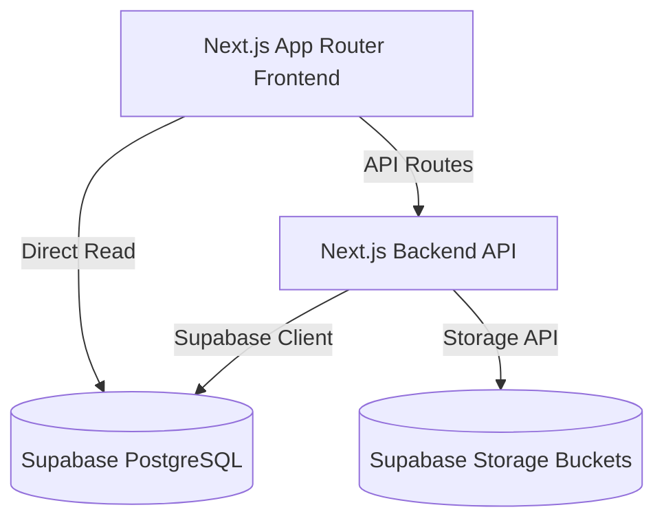

# Product Requirements Document (PRD): Cyberpunk OS Portfolio & Recruiter Engine

## 1. Executive Summary
This project is a high-performance, immersive developer portfolio styled as a futuristic, glassmorphic **Cyberpunk Operating System (OS)**. Beyond a standard static profile, the application serves as a dynamic recruiter-conversion funnel. It integrates interactive chatbot automation, targeted resume customization engines, real-time analytics tracking, and a comprehensive project administration panel (CMS) connected to a Supabase database.

---

## 2. Goals & Objectives
*   **Immersive User Experience:** Capture attention immediately using custom-designed Cyberpunk aesthetics, high-end Framer Motion animations, responsive terminal aesthetics, and dynamic glow styling.
*   **High-Volume Lead Generation:** Funnel recruiters and engineering managers into hiring conversations via interactive recruiters-specific workflows and a custom AI chatbot.
*   **Self-Managed Administration:** Provide a secure admin panel enabling the developer to upload projects (with support for multiple screenshots/galleries), update work experience, configure social links, and track visitor analytics.
*   **Bulletproof Deployment Stability:** Maintain maximum compilation speeds and runtime uptime using Next.js, Webpack stability configuration, and lightweight inline asset rendering.

---

## 3. User Personas
### Persona A: The Recruiter (Short on Time)
*   **Needs:** Quick access to the candidate’s stack, location, resume download, and matching projects.
*   **Pain Points:** Digging through generic portfolios to find specific tech alignments.
*   **Features Used:** Recruiter CTA Hub, custom resume variant download, print-friendly resume view.

### Persona B: The Engineering Manager (Detail-Oriented)
*   **Needs:** High-quality code examples, system architecture breakdowns, and deep project details.
*   **Pain Points:** Lack of depth in project showcases (e.g., single screenshot portfolios).
*   **Features Used:** Projects Gallery Carousel/Lightbox, technology stack breakdown, interactive project terminal.

### Persona C: The Developer (Administrator)
*   **Needs:** Easy tools to add new projects, upload screenshot galleries, check analytics, and manage settings.
*   **Pain Points:** Modifying source files or committing code just to edit text or update social links.
*   **Features Used:** Admin Dashboard, profile-form component, image/file uploader, settings panel.

---

## 4. Key Functional Features
### 4.1. Cyberpunk OS Shell & Desktop UI
*   **Terminal Interface:** Integrated terminal components simulating system logs, commands, and interactive utilities.
*   **Interactive Accent Colors:** Custom palette utilizing dark transparent layouts, high-intensity neon border glows, and custom SVG icons for social/tech indicators.

### 4.2. Recruiter Hub & Resume Variant Engine
*   **Resume Optimization API:** Next.js route optimizing resume keywords and details based on recruiter criteria.
*   **Print Optimization:** Dynamic styles for neat, grid-aligned, standard print formats when outputted as a PDF.
*   **Engagement Analytics:** Logs and tracks visits, clicks on download links, and chatbot requests.

### 4.3. Multi-Image Projects Gallery (CMS)
*   **CMS Project Editor:** Allows creating/editing projects, ordering items, and uploading multiple project screenshots.
*   **Framer Motion Carousel:** Slider showing project screenshots with thumbnail pagination.
*   **Lightbox Zoom:** Interactive fullscreen preview modal for detailed image inspection.

### 4.4. Dynamic Social & Contact Integration
*   **Social Link Resolver:** Loads active social profiles dynamically from Supabase database settings.
*   **Inline SVG Icons:** Uses inline SVG shapes for LinkedIn, GitHub, Instagram, and Message/Email links to bypass library package constraints.

---

## 5. System Architecture & Tech Stack

### 5.1. Tech Stack Details
*   **Framework:** Next.js 16 (App Router)
*   **Language:** TypeScript
*   **Styling:** Tailwind CSS v4 (utilizing utility classes and custom theme extensions)
*   **Animations:** Framer Motion
*   **Database & Auth:** Supabase PostgreSQL and Row-Level Security (RLS)
*   **Bundler:** Webpack Dev Server (configured for stability in sandbox environments)

### 5.2. Data Models (Supabase)
*   **`profiles`**: Developer bio, contact details, email, current status.
*   **`projects`**: ID, title, slug, summary, description, primary_image, tags, repository_url, live_url.
*   **`project_images`**: Relation linking multiple screenshot URLs, caption descriptions, and sort order mappings to projects.
*   **`social_links`**: ID, platform, url, sort_order, active_status.
*   **`analytics_logs`**: Logs page hits, download events, and chatbot interactions.

---

## 6. Non-Functional Requirements (NFRs)
*   **SEO:** Descriptive metadata, custom OpenGraph tags, semantic HTML tags, and clean URLs.
*   **Performance:** Code splitting, image optimization (`next/image`), and responsive loading boundaries.
*   **Security:** Supabase Row Level Security (RLS) policies requiring authentication for all mutation queries (insert, update, delete) while allowing public read-only access.
